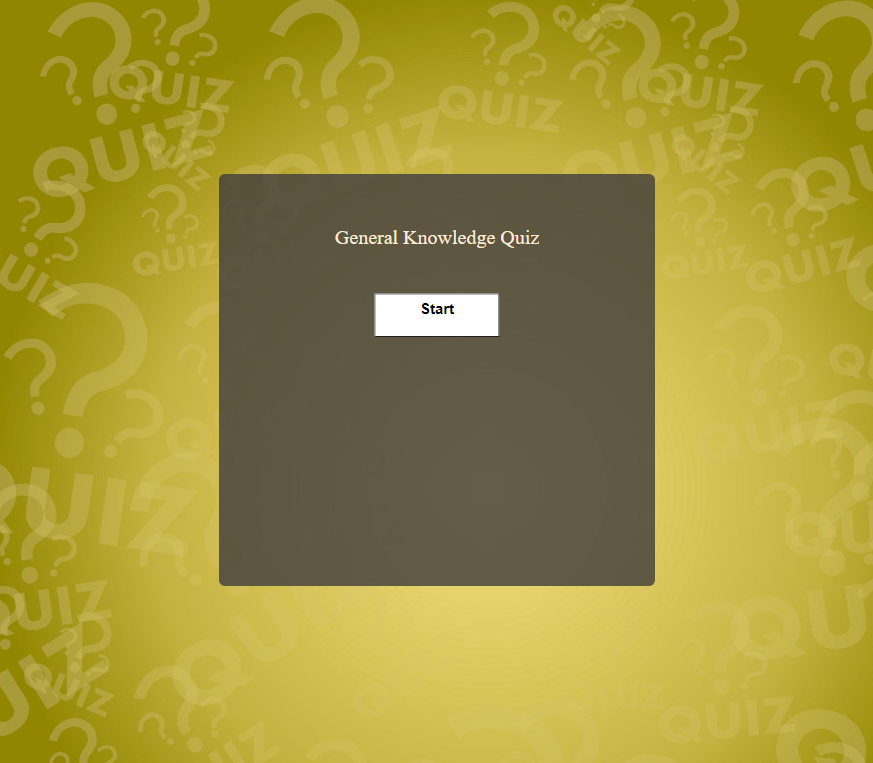

# General Knowledge Quiz

This website was created as part of my Full Stack Diploma course. It is a fully interactive general knowledge quiz consisting of 15 multiple choice questions. The aim of the website is for people to test their quiz knowledge and have fun. 

## Features

**Start Button**

- Clicking on the Start Button starts the quiz and displays the first question and 3 possible answers.

- Clicking on one of the answers will confirm your answer choice.

- Once clicked buttons will then be disabled and your choice will turn either green(correct) or red(wrong).

- A hidden timer will be activated and next question and answers will be displayed after 1 sec.

- Once the array of questions are completed you will be shown your score out of 15.

- A alert message will display and a message will appear, depending on how you scored a different message will be displayed.

- A 'try again' button will also appear to restart the quiz.

**Home Page**

- Displays the question box and start button.

**Question Page**

- Containes the questions and answers.

- Quiz is now running.

**Score Page**

- Displays your score.

- Alert message is shown, message will be relevant to the score. 

## Running Tests

**Html Validation**

1) Open up workspace in Gitpod.

2) Open index.html and copy all code.

3) Open https://validator.w3.org/ in seperate tab.

4) Click validate code by direct input.

5) Paste code.

6) Click check button and wait for results.

7) Repeat steps 2-6 for class-schedule.html and trial-class.html.

8) Fix any issues in Gitpod workspace and re-test.

**CSS Validation**

1) Open up workspace in Gitpod.

2) Open style.css found in the assets folder and copy all code.

3) Open https://jigsaw.w3.org/css-validator/ in a seperate tab.

4) Click validate code by direct input.

5) Paste code.

6) Click check button and wait for results.

7) Fix any issues in Gitpod workspace and re-test.

**Javascript Validation**

1) Open up workspace in Gitpod.

2) Open script.js found in the assets folder and copy all code.

3) Open https://jshint.com/ in a seperate tab.

4) Paste code.

5) Click configure button and wait for results.

6) Fix any issues in Gitpod workspace and re-test.

**Manual Testing**

Start Button

- Click the start button and confirm it starts quiz.

- Upon checking everything was as expected.

Answer Buttons

- Check that on clicking the answer is selected.

- Check that if wrong answer is chosen, button turns red and the correct answer appears as green.

- Check that all buttons are disabled after choice has been made.

- Upon checking everything was as expected.

Try Again Button

- Check that when clicked quiz restarts.

- Upon checking everything was as expected.

Console.log()

- All functions were tested using console.log.

- One issue appeared but dosent impact the functioning of the quiz.

**Lighthouse**

**Accessibility**

- Quiz was checked using https://wave.webaim.org/ and had the following issue which dosent impact functionality and are not of particular importance for this particular javascript project.

## Libraries and Programmes

- Git for version control.

- Github to save and store the files for the website.

- Google Devoloper Tools to troubleshoot and test features, solve issues with responsiveness and styling.

- W3C Validator- used for checking HTML and CSS for errors.

- JSlint for testing javascript.

- sweetalert.js.org for swal(alert).

## Version control

**Git commands**

To push code from githod to github follow these instructions in the terminal;

1) git add .

2) Git commit -m "message about whats being added"

3) git push

## Deployment

The site was deployed to GitHub Pages.

1) Go to Github repo
2) Click on "Settings"
3) Click on "Pages"(tab on the left sidebar)
4) Scroll to "Build and deployment"/"Source" section
5) Find sub-section "Branch"
6) From drop-down manu "none"/"select branch" choose source "main" and folder "/root"
7) Click "Save"
8) Wait until you can see a link for deployed page within Github Page section, this can take a while and once the page updates you will see a message:
9) Your site is live at https://kdeane87.github.io/General-knowledge-quiz-pp2/
 

## Bugs

- The following were detected after testing but do not impact the quiz.

## Credits

- https://wave.webaim.org/- Used to test for accessibility.

- https://validator.w3.org/- Used for testing HTML.

- https://jigsaw.w3.org/css-validator/- Used for testing CSS.

- Shutterstock- Used for background image.

- https://ui.dev/amiresponsive- Used for screenshots on readme.

- Stack overflow- Used as reference.

- Code institute Love Maths- Used as referance.

- Slack used for referance.

- https://pubquizquestionshq.com/ used for the questions.

- Used READme from my project 1 https://kdeane87.github.io/Kimura-jiu-jitsu/ as a template.

